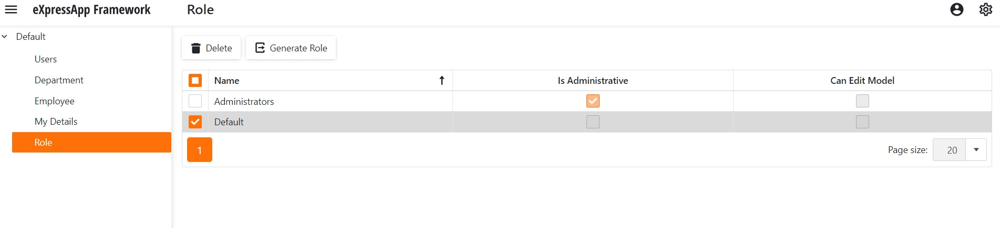

<!-- default badges list -->

[](https://supportcenter.devexpress.com/ticket/details/T868197)
[](https://docs.devexpress.com/GeneralInformation/403183)
[](#does-this-example-address-your-development-requirementsobjectives)
<!-- default badges end -->
# How to generate database updater code for security roles created via the application UI in a development environment

## Scenario
XAF developers often create initial security roles via the administrative UI (at runtime) in non-production databases of their test environments. The visual approach is often faster than writing code manually, especially for complex permissions with criteria ([check screenshots](https://docs.devexpress.com/eXpressAppFramework/113366/concepts/security-system)). If you create initial roles at runtime with test databases, you need to eventually transfer this data to production databases on customer sites.

> Note: You can find the solution for Full Framework, WebForms, VB.NET in the [20.1.3 branch](https://github.com/DevExpress-Examples/XAF_How-to-get-role-code-from-the-UI/tree/20.1.3+).

## Solution
[ModuleUpdater](https://docs.devexpress.com/eXpressAppFramework/DevExpress.ExpressApp.Updating.ModuleUpdater) API and [DBUpdater](https://docs.devexpress.com/eXpressAppFramework/113239/deployment/deployment-tutorial/application-update#update-a-database-dbupdater-tool) are standard means to seed initial data in databases with XAF.
We will demonstrate how to automatically create ModuleUpdater code for required roles created by XAF developers at runtime with test databases. XAF developers can easily copy and paste this ready code into their ModuleUpdater descendant and use the standard DBUpdater tool to seed data in production databases. We intentionally skip user creation code, because user names are often unknown at early stages and it is much easier to create and link users to predefined roles later in production environment.


>If this solution does not work for you, you can dump required data records from the development database to an XML file and then load this XML file from an application using the production database or transfer data using the built-in RDBMS capabilities. For more information, please review [Security - Best Practices for Export/Import Role Permissions at runtime (without releasing a new application version to clients)](https://supportcenter.devexpress.com/ticket/details/t951640/security-best-practices-for-export-import-role-permissions-at-runtime-without-releasing).

---

## Implementation Steps

**Step 1.** In the Solution Explorer, include [RoleGenerator.csproj](RoleGenerator/RoleGenerator.csproj) into your XAF solution and then reference this *RoleGenerator* project from the *YourSolutionName.Module* one.
 
**Step 2.** Add the following files to your XAF solution projects
 - *YourSolutionName.Module*: [RoleGeneratorController.cs](XafSolution.Module/Controllers/RoleGeneratorController.cs);
 - *YourSolutionName.Module.Win*: [RoleGeneratorControllerWin.cs](XafSolution.Module.Win/Controllers/RoleGeneratorControllerWin.cs);
 - *YourSolutionName.Module.Blazor*: [RoleGeneratorControllerBlazor.cs](XafSolution.Module.Blazor/Controllers/RoleGeneratorControllerBlazor.cs).

**Step 3.** Modify the [YourSolutionName.Win/App.config](XafSolution.Win/App.config) and [YourSolutionName.Blazor.Server/appsettings.json](XafSolution.Blazor.Server/appsettings.json) files to add the `EnableRoleGeneratorAction` key under the `appSettings` section.
``` xml
<appSettings>
    ...
  <add key="EnableRoleGeneratorAction" value="True" />
</appSettings>
```
``` json
"EnableRoleGeneratorAction": "True",
```
**Step 4.** Run the *YourSolutionName.Win* or *YourSolutionName.Blazor.Server* project, select roles in the `Role` ListView, and click the `Generate Role` Action (in the WinForms project, this Action is under the `Tools` menu).
 
WinForms:


   
ASP.NetCore Blazor:

 
    
**Step 5.** Save the generated file and research its content. It contains code that creates initial roles based on data stored in your test database. To use this file in your XAF solution, consider one of these two strategies:
 - Modify the existing *YourSolutionName.Module/DatabaseUpdate/Updater.xx* file based on the `CreateUsersRole` method code copied from the generated *Updater.xx* file.
 - Include the generated *Updater.xx* file into the *YourSolutionName.Module/DatabaseUpdate* folder and modify the [YourSolutionName/Module.cs](XafSolution.Module/Module.cs) file to use this new `RoleUpdater` class as follows:
 
``` csharp
// C#
using System;
using DevExpress.ExpressApp;
using System.Collections.Generic;
using DevExpress.ExpressApp.Updating;

namespace YourSolutionName.Module {
  public sealed partial class YourSolutionNameModule : ModuleBase {
    public override IEnumerable<ModuleUpdater> GetModuleUpdaters(IObjectSpace objectSpace, Version versionFromDB) {
      ModuleUpdater updater = new DatabaseUpdate.Updater(objectSpace, versionFromDB);
        ModuleUpdater roleUpdater = new RoleUpdater(objectSpace, versionFromDB);
    	return new ModuleUpdater[] { updater, roleUpdater };
//...
```

> Note: In the ASP.NetCore Blazor application, the file is saved to the Documents folder by default. You can change this behavior by overriding the RoleGeneratorControllerBlazor.SaveFile method.

## Customization for Custom Security Roles
If you have a custom security role class (for instance, `ExtendedSecurityRole` as in these examples: [one](https://docs.devexpress.com/eXpressAppFramework/113452/task-based-help/security/how-to-implement-a-custom-security-system-user-based-on-an-existing-business-class), [two](https://docs.devexpress.com/eXpressAppFramework/113384/task-based-help/security/how-to-implement-custom-security-objects-users-roles-operation-permissions)) and this class has custom properties, you need to include these properties into the generated code. To do this, handle the `RoleGenerator.CustomizeCodeLines` event in the `RoleGeneratorController` class added at Step 2:

``` csharp
// C#
using System.Collections.Generic;
using System.Linq;
using DevExpress.ExpressApp;
using DevExpress.ExpressApp.Actions;
using DevExpress.Persistent.Base;
using RoleGeneratorSpace;

namespace XafSolution.Module.Controllers {
    public abstract class RoleGeneratorController : ViewController<ListView> {
	//...
        protected void RoleGeneratorAction_Execute(object sender, SimpleActionExecuteEventArgs e) {
            RoleGenerator roleGenerator = new RoleGenerator(roleType);
            roleGenerator.CustomizeCodeLines += RoleGenerator_CustomizeCodeLines;
            IEnumerable<IPermissionPolicyRole> roleList = e.SelectedObjects.OfType<IPermissionPolicyRole>();
            string updaterCode = roleGenerator.GetUpdaterCode(roleList);
            SaveFile(updaterCode);
        }

        private void RoleGenerator_CustomizeCodeLines(object sender, CustomizeCodeLinesEventArg e) {
            ExtendedSecurityRole exRole = e.Role as ExtendedSecurityRole;
            if(exRole != null) {
                e.CustomCodeLines.Add(string.Format("role.CanExport = {0};", exRole.CanExport.ToString().ToLowerInvariant()));
            }
        }
    }
}

```


<!-- feedback -->
## Does this example address your development requirements/objectives?

[](https://www.devexpress.com/support/examples/survey.xml?utm_source=github&utm_campaign=XAF_How-to-get-role-code-from-the-UI&~~~was_helpful=yes) [](https://www.devexpress.com/support/examples/survey.xml?utm_source=github&utm_campaign=XAF_How-to-get-role-code-from-the-UI&~~~was_helpful=no)

(you will be redirected to DevExpress.com to submit your response)
<!-- feedback end -->
