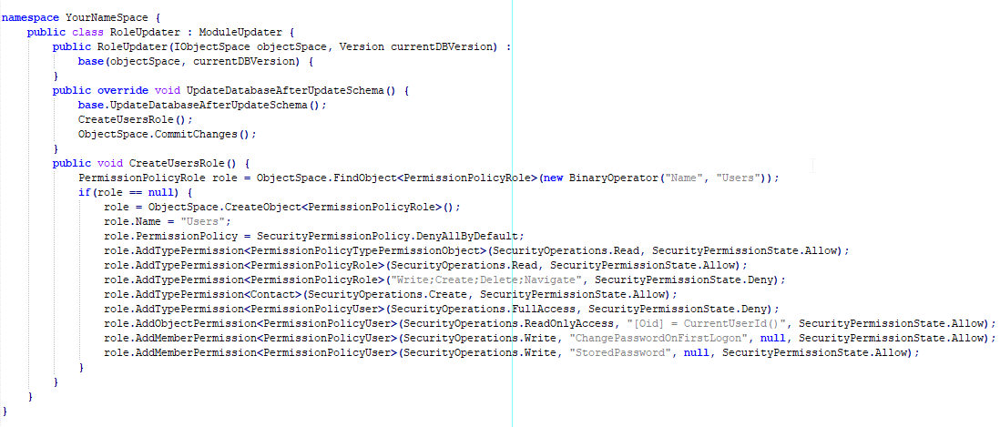
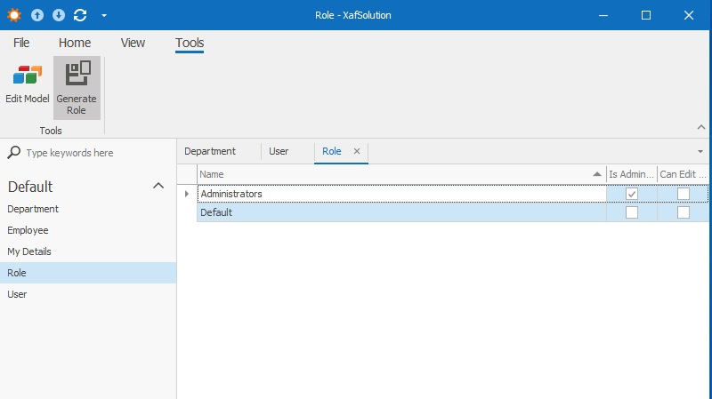
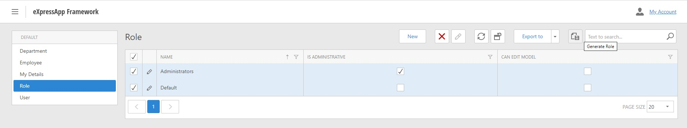

# How to get role code from the UI

This article demonstrates how to get role code from the UI.


### Problem
You can create roles in the UI to test them, but it's difficult to write code that creates these roles in the Updater. 
You can use the approach described below to create an Updater file from the UI.


### How does it work?
 **1.** Add the [RoleGenerator](RoleGenerator/RoleGenerator.cs) project to your solution.
 **2.** Add a reference to the RoleGenerator project to your Module project.
 **3.** Add the [RoleGeneratorController](XafSolution.Module/Controllers/RoleGeneratorController.cs) class to your Module project.
 **4.** Add the [RoleGeneratorControllerWin](XafSolution.Module.Win/Controllers/RoleGeneratorControllerWin.cs) controller to your Module.Win project and the [RoleGeneratorControllerWeb](XafSolution.Module.Web/Controllers/RoleGeneratorControllerWeb.cs) controller to your Module.Web project.
 **5.** Add the following key to the [App.config](XafSolution.Module.Win/app.config) file in your Win project and to the [Web.config](XafSolution.Module.Web/Web.config) file in your Web project
``` xml
<appSettings>
    ...
  <add key="EnableRoleGeneratorAction" value="True" />
</appSettings>
```
 **6.** Run your Win or Web project, select roles in RoleListView, and click the Generate Role action. In Win projects, this action is in the 'Tools' category.
 WinForms:
    
ASP.NET:
    
 **7.** Save the file. You will get a ready-to-use Updater file with the code that creates roles.
 
 
 To use this file in your XAF app, follow these steps:
 **1.** Include it in your Module project.
 **2.** Modify your [Module.cs](\XafSolution.Module\Module.cs) file to use this new Updater:

  	[](#tab/tabid-csharp)

``` csharp
using System;
using DevExpress.ExpressApp;
using System.Collections.Generic;
using DevExpress.ExpressApp.Updating;

namespace YourSolutionName.Module {
  public sealed partial class YourSolutionNameModule : ModuleBase {
    public override IEnumerable<ModuleUpdater> GetModuleUpdaters(IObjectSpace objectSpace, Version versionFromDB) {
      ModuleUpdater updater = new DatabaseUpdate.Updater(objectSpace, versionFromDB);
        ModuleUpdater roleUpdater = new RoleUpdater(objectSpace, versionFromDB);
    	return new ModuleUpdater[] { updater, roleUpdater };
//...
```

### Customization
If you have a custom role, customize [RoleGenerator](RoleGenerator/RoleGenerator.cs) to get the necessary code lines.
To do it, modify the `GetCodeLinesFromRole` method and add necessary code lines in `codeLines` List.

``` csharp
using DevExpress.ExpressApp.Security;
using DevExpress.Persistent.Base;
using System;
using System.Collections.Generic;

namespace RoleGeneratorSpace {
  public class RoleGenerator {
    private List<string> GetCodeLinesFromRole(IPermissionPolicyRole role) {
      List<string> codeLines = new List<string>();
      if(role != null) {
        codeLines.Add($"{variableName}.Name = \"{role.Name}\";");
        codeLines.Add($"{variableName}.PermissionPolicy = SecurityPermissionPolicy.{role.PermissionPolicy.ToString()};");
        if(role.IsAdministrative) {
          codeLines.Add($"{variableName}.IsAdministrative = true;");
        }
        if(role.CanEditModel) {
          codeLines.Add($"{variableName}.CanEditModel = true;");
        }
        //place your custom code here
        //codeLines.Add("your custom code line");
        foreach(IPermissionPolicyTypePermissionObject typePermissionObject in role.TypePermissions) {
          codeLines.AddRange(GetCodeLinesFromTypePermissionObject(typePermissionObject));
        }
        if(role is INavigationPermissions navigationPermissionsRole) {
          foreach(IPermissionPolicyNavigationPermissionObject navigationPermissionObject in navigationPermissionsRole.NavigationPermissions) {
            string codeLine = GetCodeLine(navigationPermissionObject);
            if(codeLine != string.Empty) {
              codeLines.Add(codeLine);
            }
          }
        }
      }
      return codeLines;
    }
//...
```
